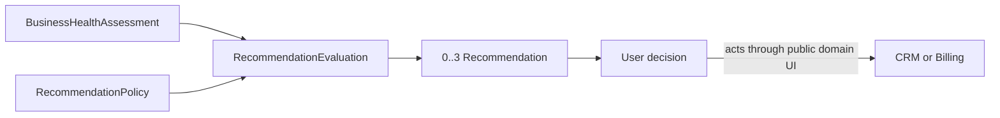

# Advisor

> Advisor transforme une évaluation Business Health fiable en un petit nombre
> d'actions prioritaires, explicables et laissées au contrôle de l'utilisateur.

Il répond à cinq questions :

1. quelle action mérite la priorité maintenant ;
2. pourquoi cette action est-elle proposée ;
3. quels faits et quelle règle la justifient ;
4. quels impact, urgence, confiance et effort ont déterminé son rang ;
5. jusqu'à quand son contexte reste-t-il valide.

## Responsabilités

Advisor possède :

- la `RecommendationPolicy` globale, immuable et versionnée ;
- les `RecommendationEvaluation` et `Recommendation` historisées ;
- la priorité, le rang, la confiance et l'impact qualitatif ;
- la `RecommendationAction` principale et sa capacité requise ;
- le cycle `Generated | Completed | Dismissed | Expired` ;
- l'explication et les révisions de preuve de chaque recommandation.

Advisor ne possède pas :

- les métriques Analytics ou évaluations Business Health ;
- les Clients, Opportunities, Quotes, Invoices ou Payments ;
- l'exécution d'une action CRM ou Billing ;
- les notifications, automatisations ou mesures de télémétrie produit ;
- les prédictions, gains chiffrés ou décisions autonomes.

## Flux 1.0

La Recommendation propose. L'utilisateur décide et agit par le domaine
propriétaire. Une clôture confirme l'action ; elle ne prouve pas son résultat.

## Garanties essentielles

- aucune recommandation sans source exacte, règle et explication ;
- aucune lecture directe d'Analytics, CRM ou Billing en 1.0 ;
- au plus trois recommandations `Generated`, dont une priorité principale ;
- aucune action source exécutée avec l'autorité d'Advisor ;
- aucune confiance présentée comme probabilité ;
- aucun impact financier chiffré sans modèle calibré ;
- aucune réactivation d'une Recommendation terminale.

## Statut

Advisor 1.0 est `In Review`. Sa couverture complète figure dans
[`consolidation-matrix.md`](consolidation-matrix.md).
