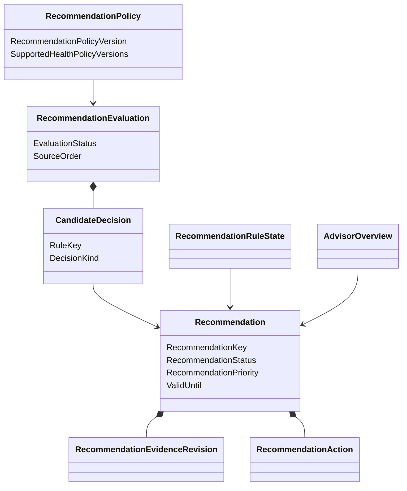

# Modèle du domaine

## Vue conceptuelle



## Chaîne de décision

```text
immutable BusinessHealthAssessment
              +
immutable RecommendationPolicy
              ↓
durable RecommendationEvaluation
              ↓
0..3 Recommendation aggregates
              ↓
AdvisorOverview primary + alternatives
```

## Deux agrégats distincts

- `RecommendationEvaluation` prouve que toutes les règles ont été évaluées
  exactement une fois pour une source et une politique ;
- `Recommendation` porte une proposition visible, ses révisions de preuve et
  son cycle de vie utilisateur.

Une évaluation peut ne créer aucune Recommendation. Cette absence reste un
résultat explicable, pas un échec.

## Projections

`RecommendationRuleState` résume, par RecommendationKey, le fingerprint actif,
le dernier fingerprint terminal et la dernière disparition du prédicat.

`AdvisorOverview` contient au plus trois Recommendation `Generated`, triées par
l'ordre canonique. La première est `PrimaryRecommendation`. Ces projections
sont reconstructibles à partir des agrégats et événements Advisor.

## Temps et événements tardifs

Les évaluations avancent selon
`(AsOf, SourcePublishedAt, BusinessHealthAssessmentId)` pour une même politique.
Une source plus ancienne est enregistrée comme historique sans modifier les
recommandations actives.

## Frontière d'exécution

RecommendationAction décrit un parcours. Le clic revient au client Atlas, puis
au domaine cible qui réévalue identité, permission, état et invariant. Advisor
ne détient aucune délégation permettant d'exécuter l'intention.
