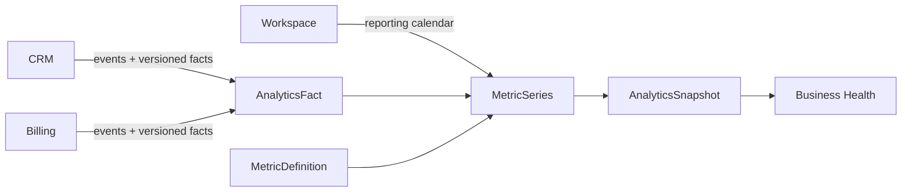

# Analytics

> Analytics transforme les faits CRM et Billing en mesures reproductibles,
> fraîches et expliquées, sans devenir propriétaire des faits observés.

Il répond à quatre questions :

1. que mesure exactement cet indicateur ;
2. quelles données et quelle période ont été utilisées ;
3. le résultat est-il complet et suffisamment récent ;
4. peut-on reproduire le même calcul avec la même définition.

## Responsabilités

Analytics possède :

- le catalogue versionné des `MetricDefinition` ;
- les `AnalyticsFact` normalisés depuis les domaines sources ;
- les `MetricSeries` et leurs dimensions autorisées ;
- les générations et checkpoints de projection ;
- les `AnalyticsSnapshot` publiés à Business Health ;
- la fraîcheur, la complétude et l'explication de chaque résultat.

Analytics ne possède pas :

- les Opportunity, Quote, Invoice, Payment ou CreditNote ;
- le chiffre financier légal ou la comptabilité ;
- l'état global de l'activité ;
- les risques, prédictions ou recommandations ;
- l'instrumentation produit, le NPS ou la télémétrie technique.

## Flux 1.0

Les événements signalent un changement. Les contrats de faits fournissent les
valeurs minimales nécessaires au calcul exact de la version concernée.

## Garanties essentielles

- aucune somme entre devises différentes ;
- `NoData` n'est jamais présenté comme zéro ;
- toute valeur expose définition, période, unité, fraîcheur et complétude ;
- toute évolution compare des observations strictement compatibles ;
- les corrections et reversals recalculent les périodes touchées ;
- un snapshot publié est immuable et peut seulement être remplacé par un autre ;
- Analytics n'envoie aucune commande vers CRM ou Billing.

## Statut

Analytics 1.0 est `In Review`. Sa couverture complète figure dans
[`consolidation-matrix.md`](consolidation-matrix.md).
