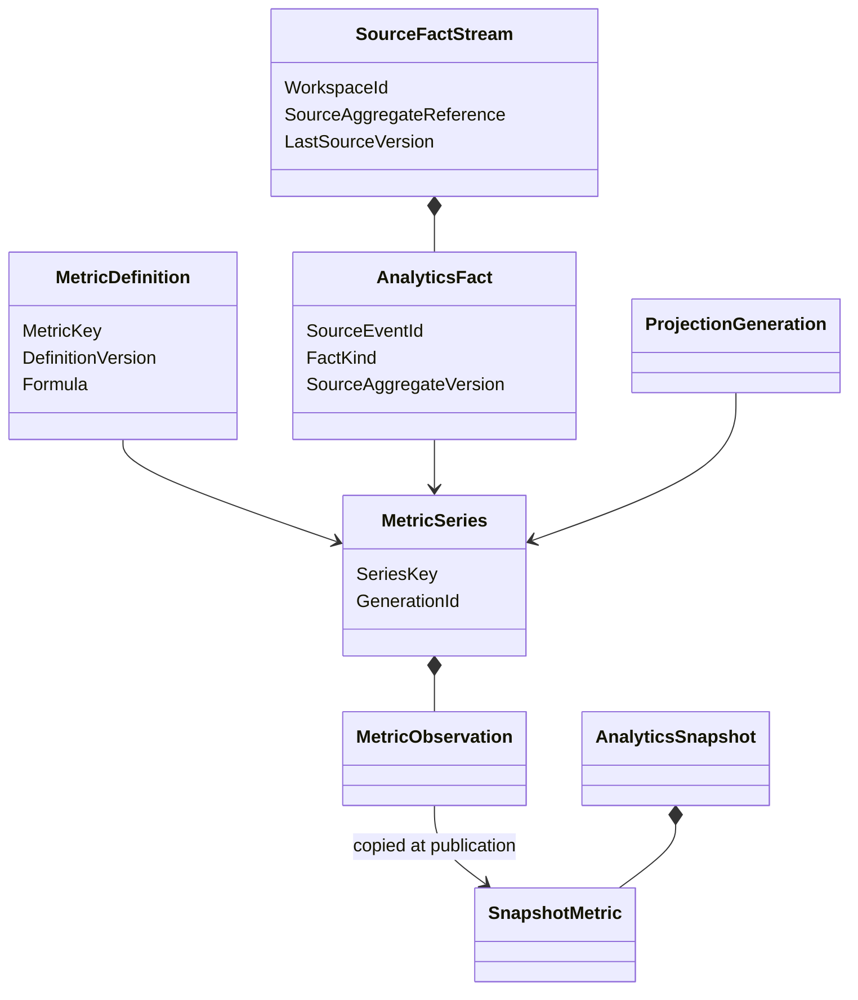

# Modèle du domaine

## Vue conceptuelle



## Trois couches distinctes

```text
Source event + versioned read
            ↓
immutable AnalyticsFact
            ↓
current MetricSeries in one ProjectionGeneration
            ↓
immutable AnalyticsSnapshot
```

Le fait source conserve la causalité. La série représente la meilleure
projection courante. Le snapshot fige un ensemble cohérent pour un consommateur.

## Stocks, flux et ratios

- un stock décrit un état à `AsOf` ;
- un flux additionne des faits sur `[StartInclusive, EndExclusive)` ;
- un ratio divise deux populations définies et expose ses composantes ;
- une durée moyenne conserve son échantillon et ses exclusions.

Ces natures ne sont jamais interchangeables. Additionner deux snapshots d'un
stock ou moyenner des ratios déjà agrégés est interdit.

## Générations de projection

Une génération suit :

```text
Building -> Active -> Superseded
       \-> Failed
```

Un rebuild écrit dans une génération `Building`. Elle ne devient `Active` que
si ses checkpoints ont rejoint les watermarks requis et si ses contrôles sont
valides. L'ancienne génération reste lisible jusqu'au basculement atomique.

## Correction et temps

Les faits passés ne sont pas édités. Une correction source, un changement de
statut ou un reversal ajoute un nouveau fait versionné puis recalcule les cellules
affectées de la projection courante.

Les snapshots déjà publiés restent immuables. Une nouvelle publication indique
la nouvelle génération, les nouveaux watermarks et la cause du remplacement.
