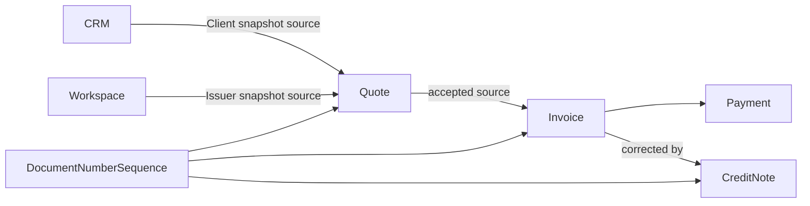

# Billing

> Billing transforme une intention commerciale en documents financiers
> traçables, puis en créance réglée ou corrigée.

Il répond à quatre questions :

1. qu'a-t-on proposé au Client ;
2. quelle créance a été légalement émise ;
3. quels règlements ou avoirs ont réduit cette créance ;
4. quel montant reste réellement dû.

---

## Responsabilités

Billing possède :

- `Quote` et son cycle de réponse ;
- `Invoice` et son contenu financier ;
- `Payment` enregistré dans une Invoice ;
- `CreditNote` et son application ;
- les numéros de documents ;
- les échéances, soldes et faits de règlement ;
- les demandes de livraison et de relance des documents.

Billing ne possède pas :

- le Client ou l'Opportunity ;
- l'identité de l'émetteur Workspace ;
- l'envoi technique d'un e-mail ;
- la comptabilité générale, le compte bancaire ou le rapprochement ;
- les recommandations et prévisions.

---

## Agrégats 1.0



| Agrégat | Rôle |
|---|---|
| `Quote` | proposition, réponse et suivi de facturation |
| `Invoice` | créance, Payments et solde courant |
| `CreditNote` | document correctif rattaché à une Invoice |
| `DocumentNumberSequence` | allocation unique et auditée des numéros |

---

## Cycles principaux

```text
Quote:      Draft -> Sending -> Sent -> Accepted | Rejected | Withdrawn | Expired
Invoice:    Draft -> Issued
               \-> Discarded
CreditNote: Draft -> Issued -> Applied
               \-> Discarded
Payment:    Recorded -> Reversed
```

Le règlement d'une Invoice est un état calculé depuis son solde, pas un
remplacement de son statut documentaire.

---

## Contrats externes

- CRM fournit `getClientBillingContext` et
  `getOpportunityCommercialContext` ;
- Workspace fournit l'identité de l'émetteur et les préférences ;
- Identity autorise les intentions humaines ;
- Communication livre les documents sans décider de leur cycle de vie ;
- Analytics et Advisor consomment les faits financiers.

Les valeurs CRM et Workspace sont copiées comme snapshots avant qu'un document
ne devienne immuable.

---

## Statut

Billing 1.0 est `In Review`. La couverture complète figure dans
[`consolidation-matrix.md`](consolidation-matrix.md).
