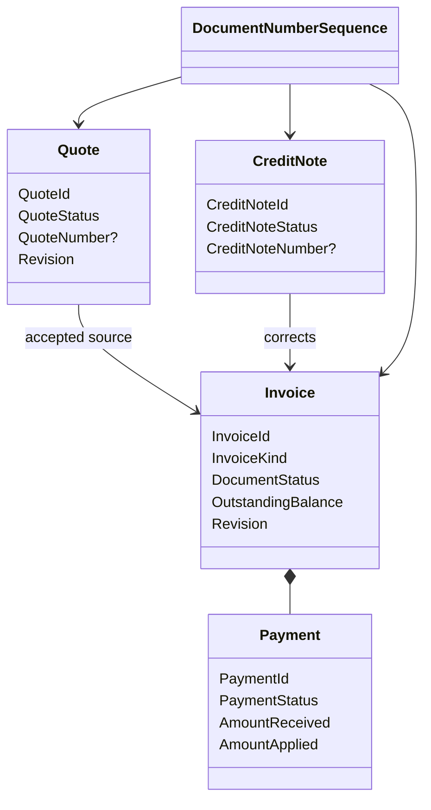

# Modèle du domaine

## Vue conceptuelle



---

## États séparés

Une Invoice distingue :

- `DocumentStatus`: `Draft`, `Issued`, `Discarded` ;
- `SettlementStatus`: `Outstanding`, `PartiallySettled`, `Settled` ;
- `Overdue`: booléen dérivé de la date et du solde ;
- `DeliveryState`: projection technique, sans effet sur la créance.

Cette séparation permet à une Invoice émise d'être simultanément partiellement
réglée et en retard sans inventer un statut combinatoire.

---

## Calcul du solde

```text
OutstandingBalance
  = IssuedTotal
  - sum(active Payment.AmountApplied)
  - sum(applied CreditNote.AmountApplied)
```

Le solde ne devient jamais négatif. Les montants reçus ou crédités au-delà du
solde restent explicitement non appliqués avec une disposition.

---

## Quote vers Invoice

Une Quote acceptée conserve un `InvoicingSummary` :

```text
DepositInvoiceId?
DepositGrossAmount
FinalInvoiceId?
FinalGrossAmount
```

Créer une Invoice depuis une Quote modifie atomiquement ce résumé et crée
l'Invoice afin d'empêcher la double facturation.

---

## Snapshots

Avant finalisation ou émission, Billing copie :

- `ClientSnapshot` depuis CRM ;
- `IssuerSnapshot` depuis Workspace ;
- `OpportunitySnapshot?` depuis CRM ;
- la devise, les taxes et la politique de calcul effectives.

Une mise à jour externe n'altère jamais le document figé.
