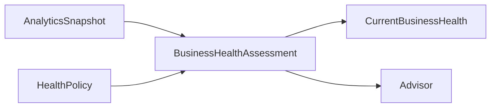

# Business Health

> Business Health interprète un snapshot Analytics cohérent pour produire une
> évaluation globale, explicable et prudente de l'activité.

Il répond à cinq questions :

1. quel est le niveau de santé récent de l'activité ;
2. quels facteurs contribuent au résultat ;
3. la situation s'améliore-t-elle, se dégrade-t-elle ou reste-t-elle stable ;
4. quels risques observables méritent l'attention ;
5. quelle zone d'attention pèse le plus sur l'évaluation.

## Responsabilités

Business Health possède :

- la `HealthPolicy` globale, immuable et versionnée ;
- les `BusinessHealthAssessment` immuables ;
- les `HealthFactor`, scores, bandes, tendances et risques interprétés ;
- la `PrimaryAttention` et l'explication de chaque résultat ;
- la fiabilité et la couverture de chaque évaluation.

Business Health ne possède pas :

- les faits CRM ou Billing ;
- les définitions et valeurs de métriques Analytics ;
- une vérité comptable, bancaire ou sectorielle ;
- les Recommendation, actions ou priorités d'exécution ;
- une prédiction de revenu, de trésorerie ou de défaillance.

## Flux 1.0

Une évaluation est une interprétation datée. Elle n'est ni un diagnostic absolu,
ni une instruction automatique.

## Garanties essentielles

- aucune donnée manquante n'est remplacée par zéro ;
- aucune somme ou comparaison implicite entre devises ;
- chaque score expose politique, facteurs, couverture et preuves ;
- les seuils 1.0 sont une politique produit, pas un benchmark sectoriel ;
- un résultat ancien reste immuable après correction ou nouvelle politique ;
- un risque décrit une condition observée, jamais une action à exécuter ;
- Advisor reste seul propriétaire des recommandations.

## Statut

Business Health 1.0 est `In Review`. Sa couverture complète figure dans
[`consolidation-matrix.md`](consolidation-matrix.md).
