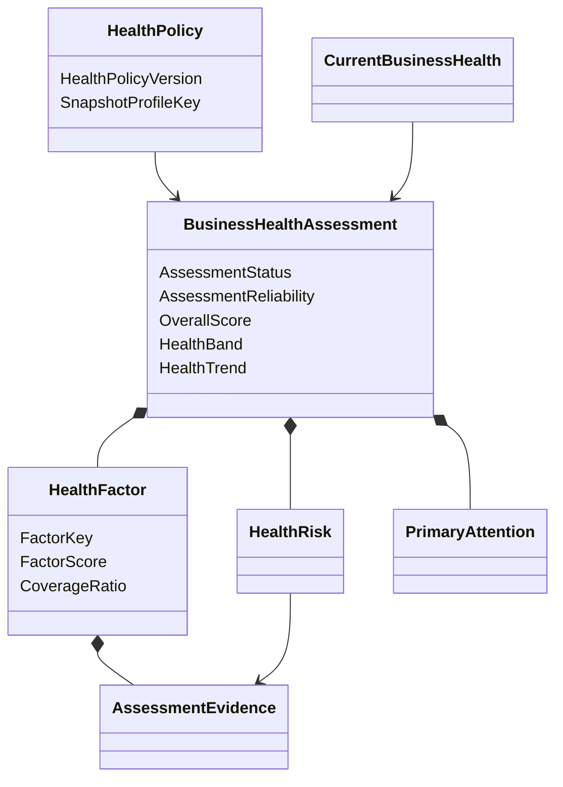

# Modèle du domaine

## Vue conceptuelle



## Chaîne d'interprétation

```text
immutable AnalyticsSnapshot
            +
immutable HealthPolicy
            ↓
immutable BusinessHealthAssessment
            ↓
CurrentBusinessHealth projection
            ↓
Advisor reads exact assessment
```

Business Health ne recalcule aucune MetricValue. Il interprète uniquement les
valeurs, périodes, comparaisons, couvertures et fraîcheurs figées dans le
snapshot.

## Évaluation disponible ou insuffisante

Une évaluation est toujours créée pour un couple snapshot/politique accepté :

- `Available` si un OverallScore satisfait les règles de couverture ;
- `InsufficientData` si les données ne permettent pas ce score.

Le second état conserve les causes et preuves disponibles. Il ne publie ni
score, ni bande, ni PrimaryAttention et sa fiabilité vaut `Insufficient`.

## Historique immuable

Une correction Analytics produit un nouveau snapshot puis une nouvelle
évaluation. Une nouvelle HealthPolicy produit également une nouvelle évaluation.
Le passé n'est jamais réécrit.

Chaque HealthPolicyVersion possède sa propre projection courante. Elle
sélectionne l'évaluation maximale selon le tuple
`(AsOf, SourcePublishedAt, BusinessHealthAssessmentId)`. La lecture publique
résout ensuite la version de politique active. Une publication tardive peut
enrichir l'historique sans faire régresser la vue courante de cette politique.

## Frontière avec Advisor

`PrimaryAttention` nomme le facteur au déficit le plus important. `HealthRisk`
nomme une condition observée. Aucun des deux ne contient un verbe d'action, une
échéance ou une RecommendationPriority : ces décisions appartiennent à Advisor.
