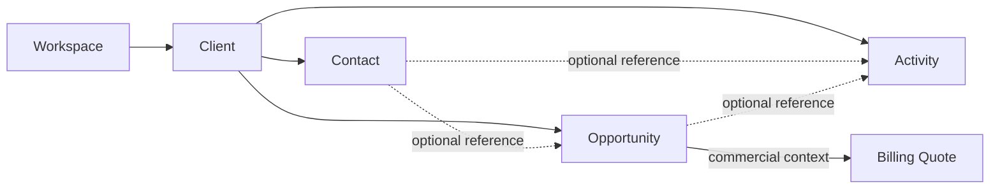

# CRM

> CRM conserve la mémoire commerciale fiable d'un Workspace, depuis la
> contrepartie identifiée jusqu'au résultat d'une opportunité.

Il permet de savoir :

1. avec qui l'activité entretient ou envisage une relation commerciale ;
2. quelles personnes permettent d'agir dans cette relation ;
3. quelles ventes potentielles méritent un suivi ;
4. quelles interactions commerciales ont déjà eu lieu.

---

## Responsabilités

CRM possède :

- `Client`, contrepartie stable d'une relation potentielle ou établie ;
- `Contact`, personne rattachée à un Client ;
- `Opportunity`, vente potentielle identifiée ;
- `Activity`, interaction commerciale enregistrée ;
- les projections de pipeline construites à partir des opportunités.

CRM ne possède pas :

- le Workspace, ses membres ou leurs autorisations ;
- les devis, factures et paiements ;
- les projets ou missions ;
- les recommandations, scores ou prédictions ;
- les e-mails, calendriers ou notifications externes.

---

## Modèle 1.0



Agrégats 1.0 :

- `Client`, contenant ses `Contact` ;
- `Opportunity` ;
- `Activity`.

`Pipeline` est une projection de lecture, jamais un agrégat ou un conteneur
modifiable.

---

## Cycles de vie

```text
Client:      Active <-> Archived
Contact:     Active <-> Archived
Opportunity: Open -> Qualified -> Won
                 \       \
                  +-------> Lost
Activity:    Recorded -> Removed
```

`Won`, `Lost` et `Removed` sont terminaux en 1.0. Une nouvelle intention produit
une nouvelle Opportunity ou Activity au lieu de réécrire l'histoire.

---

## Dépendances

| Domaine | Relation |
|---|---|
| `Identity` | autorise chaque intention dans le Workspace |
| `Workspace` | fournit l'état d'accès et les préférences par défaut |
| `Billing` | consomme les contextes Client et Opportunity, puis publie ses propres faits |
| `Analytics` | consomme les événements Opportunity et leurs faits versionnés minimaux |
| `Business Health` / `Advisor` | consomment les analyses en aval sans lire le stockage CRM |

Les contrats sont définis dans [`api.md`](api.md) et
[`integrations.md`](integrations.md).

---

## Statut

CRM 1.0 est `In Review`. Sa couverture et sa traçabilité figurent dans
[`consolidation-matrix.md`](consolidation-matrix.md).
