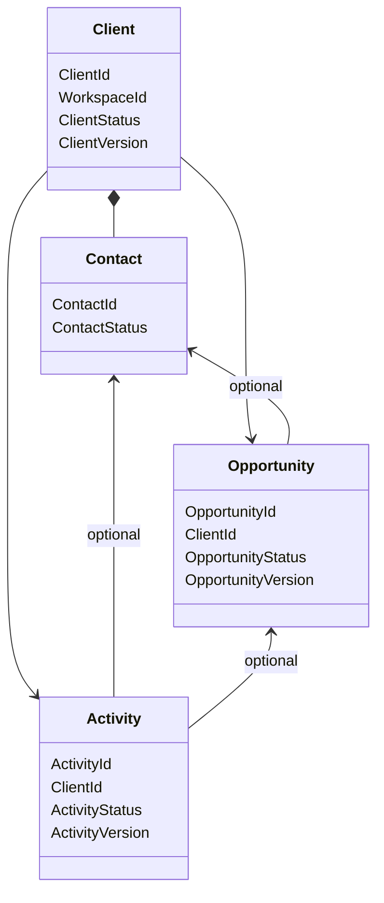

# Modèle du domaine

## Vue conceptuelle



Toutes les relations portent le même `WorkspaceId`, explicitement ou par
validation de la référence.

---

## Agrégats

| Agrégat | Contenu | Responsabilité |
|---|---|---|
| `Client` | Client et ses Contacts | cohérence de la contrepartie et du Contact principal |
| `Opportunity` | Opportunity | cycle d'une vente potentielle |
| `Activity` | Activity | trace d'une interaction commerciale |

Les agrégats se référencent uniquement par identifiants stables.

---

## Client avant et après la vente

CRM n'introduit pas de transition artificielle de « prospect » vers Client.

```text
Client identified
      |
      +--> Opportunity Open --> Qualified --> Won
      |
      +--> future Opportunity for an established relationship
```

La nature potentielle appartient à l'Opportunity. Le Client reste la
contrepartie stable et peut exister sans Opportunity.

---

## Pipeline

Le pipeline est calculé à partir des Opportunity non terminales :

```text
Open column       = OpportunityStatus.Open
Qualified column  = OpportunityStatus.Qualified
```

Les résultats `Won` et `Lost` alimentent l'historique et les analyses. Déplacer
une carte ne modifie pas une colonne arbitraire : il exécute la commande métier
correspondant à la transition.

---

## Versions et snapshots

- `Revision` protège la concurrence de chaque agrégat ;
- `ClientProfileVersion` versionne le profil commercial ;
- `ClientBillingProfileVersion` versionne les données administratives ;
- `ContactVersion` est porté dans l'agrégat Client ;
- `OpportunityVersion` et `ActivityVersion` suivent leurs faits.

Billing enregistre le numéro de version et une copie des données effectives. Il
ne conserve jamais une référence mutable comme identité affichée d'un document.
