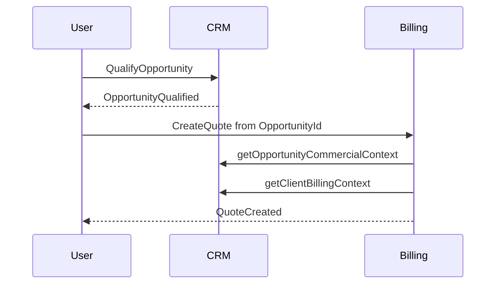

# Workflows

## Premier Client

```text
Authorize crm.clients.create
  -> CreateClient
  -> optional AddContact
  -> optional ChangeClientPrimaryContact
  -> ClientCreated / ContactAdded
```

Le parcours demande uniquement les données utiles. Le profil de facturation peut
être complété avant la première Quote ou Invoice.

---

## Capture d'une Opportunity

```text
Select or Create Client
  -> optional select Contact
  -> CreateOpportunity (Open)
  -> record next action if known
```

La saisie rapide ne crée aucun Lead intermédiaire. Un possible doublon est un
signal non bloquant.

---

## Qualification et devis



Billing peut refuser une identité Client incomplète sans modifier l'Opportunity.
L'utilisateur complète alors le profil et reprend la création de Quote.

---

## Quote acceptée

```text
QuoteAccepted
  -> orchestration validates Billing event and correlation
  -> WinOpportunity(Source = AcceptedQuote, QuoteId)
  -> OpportunityWon
```

Le workflow est idempotent par couple `QuoteId` et `OpportunityId`. Si
l'Opportunity est déjà gagnée par la même Quote, il retourne le succès initial.
Un résultat terminal incompatible déclenche une alerte de cohérence sans
réécriture automatique.

---

## Perte d'une Opportunity

L'utilisateur fournit une raison structurée. `LoseOpportunity` est distinct du
rejet d'une Quote : prix, délai ou absence de réponse peuvent conduire à une
nouvelle proposition avant la perte réelle.

---

## Archivage Client

```text
Request archive
  -> verify permission and expected revision
  -> check no Open or Qualified Opportunity
  -> ArchiveClient
  -> ClientArchived
```

Contacts et historiques restent rattachés. Les documents Billing conservent
leurs snapshots. Une réactivation rend le Client et ses Contacts encore actifs
individuellement disponibles selon leur propre statut.

---

## Historique d'activité

Les interactions manuelles utilisent `RecordActivity`. Les événements Billing
et Opportunity sont affichés dans une timeline transverse sans être copiés comme
Activity.

Une correction produit `ActivityCorrected`. Une erreur de Client exige
`RemoveActivity` puis un nouvel enregistrement afin de préserver la causalité.

---

## Fermeture ou restriction du Workspace

- `Restricted` et `Closed` bloquent les commandes CRM ordinaires ;
- aucune donnée CRM n'est automatiquement archivée ;
- les projections restent interprétables pour les traitements autorisés ;
- la rétention et l'effacement suivent des workflows de conformité séparés.
