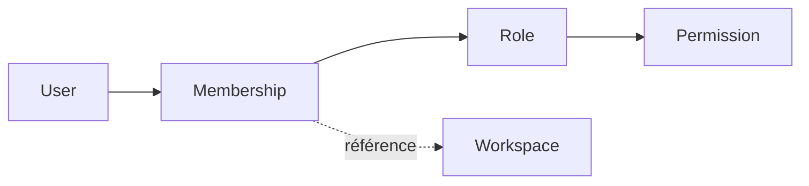
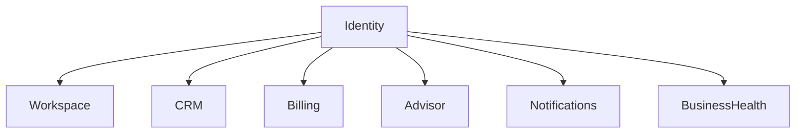

# Identity

> Le domaine **Identity** est responsable de l'identité des utilisateurs et du contrôle d'accès à Atlas.
>
> Il détermine **qui est un utilisateur**, **à quels `Workspace` il appartient** et **ce qu'il est autorisé à faire**.
>
> Il ne connaît jamais les données métier des autres domaines.

---

# Objectif

Le domaine **Identity** centralise toutes les règles relatives :

- à l'identité des utilisateurs ;
- à l'authentification ;
- aux autorisations ;
- aux rôles ;
- aux permissions ;
- aux invitations ;
- aux sessions.

Tous les autres domaines s'appuient sur **Identity** pour savoir **qui effectue une action** et **si cette action est autorisée**.

---

# Résumé du domaine

| Propriété | Valeur |
|-----------|--------|
| Type | Core Domain |
| Criticité | Critique |
| Inclus dans le MVP | Oui |
| Dépend de | Aucun domaine métier |
| Utilisé par | Tous les domaines |

---

# Langage ubiquitaire

Les concepts suivants constituent le vocabulaire officiel du domaine.

Ils doivent être utilisés tels quels dans :

- le code ;
- les événements ;
- les commandes ;
- les API ;
- les tests ;
- les diagrammes.

## Entités

- `User`
- `Membership`
- `Role`
- `Permission`
- `Invitation`
- `Session`

## Commands

- `CreateUser`
- `InviteMember`
- `AcceptInvitation`
- `DeclineInvitation`
- `AssignRole`
- `RevokeSession`

## Events

- `UserCreated`
- `MemberInvited`
- `InvitationAccepted`
- `InvitationDeclined`
- `RoleAssigned`
- `SessionRevoked`

---

# Responsabilités

Le domaine **Identity** est propriétaire de :

- `User`
- `Membership`
- `Role`
- `Permission`
- `Invitation`
- `Session`

Il est également responsable de :

- l'authentification ;
- la gestion des sessions ;
- la gestion des rôles ;
- la gestion des permissions ;
- la gestion des invitations ;
- la vérification des autorisations.

---

# Hors périmètre

Le domaine **Identity** ne possède jamais les données des autres domaines.

Par exemple :

- `Workspace`
- `Client`
- `Opportunity`
- `Quote`
- `Invoice`
- `Payment`
- `Recommendation`
- `BusinessHealth`

Il peut faire référence à ces concepts, mais leur cycle de vie est géré ailleurs.

---

# Modèle conceptuel

Le cœur du domaine est le `Membership`.

Un `User` n'appartient jamais directement à un `Workspace`.

L'appartenance est toujours matérialisée par un `Membership`, qui associe un `User`, un `Workspace` et un `Role`.

Cette modélisation permet notamment :

- plusieurs `Workspace` par `User` ;
- plusieurs membres par `Workspace` ;
- une gestion propre des invitations ;
- une évolution future du modèle d'autorisation.

---

# Dépendances

Le domaine **Identity** ne dépend d'aucun domaine métier.

Tous les autres domaines utilisent ses informations.

---

# Principes de conception

## Source de vérité

Le domaine **Identity** est la source officielle concernant :

- les utilisateurs ;
- les rôles ;
- les permissions ;
- les sessions.

Aucun autre domaine ne doit dupliquer ces informations.

---

## Principe du moindre privilège

Les permissions sont toujours accordées explicitement.

Un utilisateur ne reçoit jamais plus de droits que nécessaire.

---

## Appartenance explicite

L'accès à un `Workspace` passe toujours par un `Membership`.

Il n'existe aucun accès implicite.

---

## Autorisation par permissions

Les autorisations sont déterminées à partir des `Permission`.

Les autres domaines ne doivent jamais contenir de logique d'autorisation codée en dur.

---

# Philosophie

> **Identity sait qui est un utilisateur et ce qu'il est autorisé à faire, jamais les actions métier qu'il réalise.**

Si une fonctionnalité nécessite de connaître des informations comme un `Client`, une `Invoice` ou une `Recommendation`, elle appartient probablement à un autre domaine.

---

# Contenu du domaine

| Document | Description |
|----------|-------------|
| `mission.md` | Explique pourquoi le domaine existe. |
| `scope.md` | Définit précisément son périmètre. |
| `model.md` | Présente le modèle métier du domaine. |
| `glossary.md` | Définit les concepts officiels. |
| `entities.md` | Décrit les entités métier. |
| `aggregates.md` | Définit les agrégats. |
| `value-objects.md` | Décrit les objets valeur. |
| `commands.md` | Liste les commandes acceptées. |
| `events.md` | Décrit les événements produits. |
| `workflows.md` | Présente les principaux processus métier. |
| `invariants.md` | Regroupe les règles métier immuables. |
| `permissions.md` | Décrit le modèle d'autorisation. |
| `integrations.md` | Documente les interactions avec les autres domaines. |
| `api.md` | Présente les contrats d'échange. |
| `edge-cases.md` | Liste les cas limites connus. |
| `decision-record.md` | Explique les décisions de conception. |
| `future.md` | Documente les évolutions envisagées. |
| `checklist.md` | Vérifie la complétude du domaine. |

---

# Références

- `mission.md`
- `scope.md`
- `model.md`
- `glossary.md`
- `../../constitution.md`
- `../../language/glossary.md`