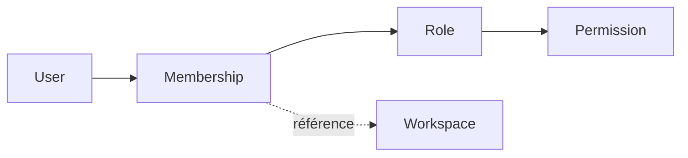
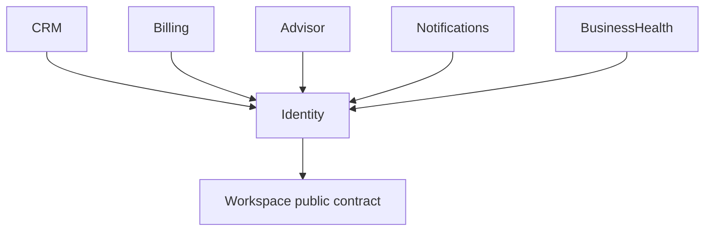

# Identity

> Le domaine **Identity** est responsable de l'identité des utilisateurs et du contrôle d'accès à Atlas.
>
> Il détermine **qui est un utilisateur**, **à quels `Workspace` il appartient** et **ce qu'il est autorisé à faire**.
>
> Il ne connaît jamais les données métier des autres domaines.

---

# Objectif

Le domaine **Identity** centralise toutes les règles relatives :

- à l'identité des utilisateurs ;
- à l'authentification ;
- aux autorisations ;
- aux rôles ;
- aux permissions ;
- aux invitations ;
- aux sessions.

Tous les autres domaines s'appuient sur **Identity** pour savoir **qui effectue une action** et **si cette action est autorisée**.

---

# Résumé du domaine

| Propriété | Valeur |
|-----------|--------|
| Type | Core Domain |
| Criticité | Critique |
| Inclus dans le MVP | Oui |
| Dépend de | Contrat public de `Workspace` |
| Utilisé par | Tous les domaines |

---

# Langage ubiquitaire

Les concepts suivants constituent le vocabulaire officiel du domaine.

Ils doivent être utilisés tels quels dans :

- le code ;
- les événements ;
- les commandes ;
- les API ;
- les tests ;
- les diagrammes.

## Entités

- `User`
- `Membership`
- `Role`
- `Permission`
- `Invitation`
- `Session`

## Commands

Le catalogue des commandes actuellement documentées se trouve dans
[`commands/README.md`](commands/README.md).

Une commande utilise le nom `Membership` lorsqu'elle modifie l'appartenance ou
le rôle contextuel d'un utilisateur.

## Events

Les événements décrivent des faits passés avec le vocabulaire officiel.

Exemples :

- `MembershipCreated` ;
- `MembershipRoleChanged` ;
- `InvitationAccepted` ;
- `RolePermissionGranted` ;
- `SessionCreated` ;
- `SessionRevoked`.

Dans l'attente d'un catalogue d'événements dédié, leur contrat est documenté
dans la commande qui les produit.

---

# Responsabilités

Le domaine **Identity** est propriétaire de :

- `User`
- `Membership`
- `Role`
- `Permission`
- `Invitation`
- `Session`

Il est également responsable de :

- l'authentification ;
- la gestion des sessions ;
- la gestion des rôles ;
- la gestion des permissions ;
- la gestion des invitations ;
- la vérification des autorisations.

---

# Hors périmètre

Le domaine **Identity** ne possède jamais les données des autres domaines.

Par exemple :

- `Workspace`
- `Client`
- `Opportunity`
- `Quote`
- `Invoice`
- `Payment`
- `Recommendation`
- `BusinessHealth`

Il peut faire référence à ces concepts, mais leur cycle de vie est géré ailleurs.

---

# Modèle conceptuel

Le cœur du domaine est le `Membership`.

Un `User` n'appartient jamais directement à un `Workspace`.

L'appartenance est toujours matérialisée par un `Membership`, qui associe un `User`, un `Workspace` et un `Role`.

Cette modélisation permet notamment :

- plusieurs `Workspace` par `User` ;
- plusieurs membres par `Workspace` ;
- une gestion propre des invitations ;
- une évolution future du modèle d'autorisation.

---

# Dépendances

Le domaine **Identity** ne dépend d'aucune donnée opérationnelle de CRM, Billing,
Advisor ou Business Health.

Il utilise toutefois le contrat public de `Workspace` pour valider qu'un espace
référencé existe et reste utilisable. Il ne possède jamais son cycle de vie.

Les autres domaines utilisent le contrat public d'Identity pour authentifier un
acteur et évaluer ses autorisations.

---

# Principes de conception

## Source de vérité

Le domaine **Identity** est la source officielle concernant :

- les utilisateurs ;
- les rôles ;
- les permissions ;
- les sessions.

Aucun autre domaine ne doit dupliquer ces informations.

---

## Principe du moindre privilège

Les permissions sont toujours accordées explicitement.

Un utilisateur ne reçoit jamais plus de droits que nécessaire.

---

## Appartenance explicite

L'accès à un `Workspace` passe toujours par un `Membership`.

Il n'existe aucun accès implicite.

---

## Autorisation par permissions

Les autorisations sont déterminées à partir des `Permission`.

Les autres domaines ne doivent jamais contenir de logique d'autorisation codée en dur.

---

# Philosophie

> **Identity sait qui est un utilisateur et ce qu'il est autorisé à faire, jamais les actions métier qu'il réalise.**

Si une fonctionnalité nécessite de connaître des informations comme un `Client`, une `Invoice` ou une `Recommendation`, elle appartient probablement à un autre domaine.

---

# Contenu du domaine

| Document | Description |
|----------|-------------|
| [`mission.md`](mission.md) | Explique pourquoi le domaine existe. |
| [`scope.md`](scope.md) | Définit précisément son périmètre. |
| [`model.md`](model.md) | Présente le modèle métier du domaine. |
| [`glossary/`](glossary/) | Définit les concepts officiels. |
| [`entities.md`](entities.md) | Décrit les entités métier. |
| [`aggregates.md`](aggregates.md) | Définit les agrégats. |
| [`relationships.md`](relationships.md) | Documente les relations et cardinalités. |
| [`value-objects.md`](value-objects.md) | Catalogue les objets valeur. |
| [`value-objects/`](value-objects/) | Détaille les politiques de rôle complexes. |
| [`commands/`](commands/) | Décrit les commandes actuellement spécifiées. |
| [`invariants.md`](invariants.md) | Regroupe les règles métier immuables. |
| [`decision-record.md`](decision-record.md) | Explique les décisions de conception. |

Les catalogues d'événements, de permissions, de workflows et de contrats API
restent à consolider. Ils ne sont pas présentés comme disponibles tant que leur
document canonique n'existe pas.

---

# Références

- [`mission.md`](mission.md)
- [`scope.md`](scope.md)
- [`model.md`](model.md)
- [`glossary/`](glossary/)
- [`../../constitution.md`](../../constitution.md)
- [`../../language/glossary.md`](../../language/glossary.md)
