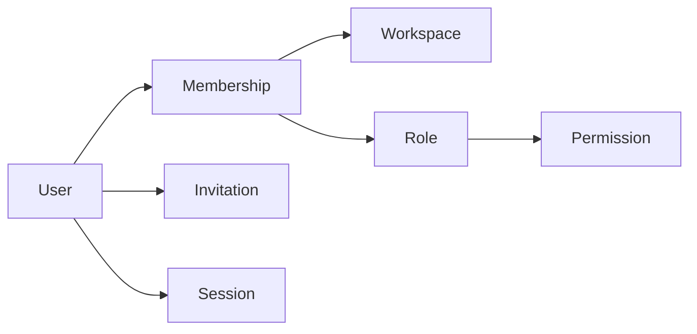
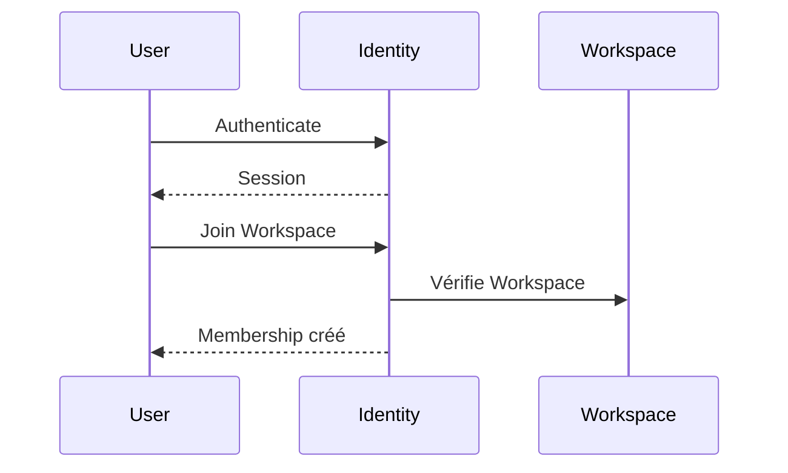

# Modèle métier

> Le domaine **Identity** modélise les utilisateurs, leur appartenance aux `Workspace` et les autorisations qui leur sont accordées.

Il ne modélise jamais les données métier des autres domaines.

---

# Objectif

Ce document présente le modèle conceptuel du domaine.

Il explique :

- les concepts principaux ;
- leurs relations ;
- les choix de modélisation ;
- les responsabilités de chaque objet.

Il constitue la référence de conception avant toute implémentation.

---

# Vue d'ensemble

Le modèle repose sur sept concepts principaux :

- `User`
- `Membership`
- `Workspace` (référence)
- `Role`
- `Permission`
- `Invitation`
- `Session`

Le point central du modèle est le `Membership`.

---

# Modèle conceptuel



---

# Principe fondamental

Un utilisateur n'appartient jamais directement à un `Workspace`.

L'appartenance est toujours représentée par un `Membership`.

Autrement dit :

```
User
    │
    ▼
Membership
    │
    ├────────────► Workspace
    │
    ▼
Role
    │
    ▼
Permission
```

Ce choix est volontaire.

Il permet de considérer l'appartenance comme un objet métier à part entière plutôt qu'une simple relation entre deux tables.

---

# Pourquoi `Membership` est central

Le `Membership` représente l'appartenance d'un `User` à un `Workspace`.

Cette appartenance possède son propre cycle de vie.

Par exemple :

- création ;
- activation ;
- suspension ;
- suppression.

Elle possède également ses propres informations :

- le `Role` attribué ;
- la date d'entrée ;
- la date de sortie ;
- l'origine de l'invitation.

Ces informations n'appartiennent ni au `User` ni au `Workspace`.

Le `Membership` devient donc naturellement une entité métier.

---

# Pourquoi `Workspace` n'appartient pas à Identity

Le domaine Identity ne connaît qu'une référence vers un `Workspace`.

Il ne connaît jamais le modèle interne du workspace, notamment :

- son nom ;
- ses paramètres ;
- son abonnement ;
- son fuseau horaire ;
- sa configuration.

Toutes ces informations appartiennent au domaine **Workspace**.

Identity consomme seulement son contrat public d'accès et de gouvernance. Il
représente l'ownership d'accès par les rôles et memberships sans posséder le
cycle de vie ni les données métier du `Workspace`.

---

# Pourquoi les permissions passent par les rôles

Le modèle est volontairement hiérarchique.

```
Role
    │
    ▼
Permission
```

Les permissions ne sont jamais attribuées directement à un `User`.

Elles sont accordées à travers un `Role`.

Cela présente plusieurs avantages :

- cohérence ;
- simplicité ;
- facilité d'administration ;
- évolutivité.

Une éventuelle surcharge de permissions pourra être étudiée plus tard, mais ne
fait pas partie d'Identity 1.0.

---

# Relations entre les concepts

## `User`

Un `User` peut posséder :

- plusieurs `Membership` ;
- plusieurs `Session`.

Il peut être relié à plusieurs `Invitation` comme destinataire connu, sans que
ces invitations appartiennent à l'agrégat `User`.

---

## `Membership`

Un `Membership` relie exactement :

- un `User` ;
- un `Workspace` ;
- un `Role`.

Il représente l'autorité d'un utilisateur dans un espace de travail.

---

## `Role`

Un `Role` regroupe plusieurs `Permission`.

Il ne connaît jamais les utilisateurs.

---

## `Permission`

Une `Permission` décrit une autorisation élémentaire.

Exemple :

- `workspace.members.read` ;
- `workspace.roles.create` ;
- `billing.invoices.issue`.

Une permission possède une identité et un statut de catalogue (`Active` ou
`Deprecated`). Son sens est défini par son domaine propriétaire.

---

## `Invitation`

Une `Invitation` permet de créer un futur `Membership`.

Elle reste conservée dans un état terminal après acceptation, refus, expiration
ou révocation afin de préserver l'audit et l'idempotence.

---

## `Session`

Une `Session` représente une authentification valide.

Elle permet d'identifier un utilisateur lors de ses requêtes.

---

# Flux principal

Le fonctionnement du domaine peut être résumé ainsi.



---

# Principes de modélisation

Le modèle respecte les principes suivants.

## Une responsabilité par concept

Chaque concept possède une responsabilité unique.

Aucun concept ne doit cumuler plusieurs responsabilités métier.

---

## Une source de vérité

Chaque donnée possède un propriétaire unique.

Les autres domaines ne peuvent conserver que des références.

---

## Références plutôt que duplication

Identity référence un `Workspace`.

Il ne copie jamais ses informations.

---

## Modèle extensible

Le modèle doit pouvoir évoluer sans remettre en cause ses fondations.

Par exemple :

- MFA ;
- Passkeys ;
- OAuth ;
- Organisations ;
- API Tokens.

Ces évolutions devront enrichir le modèle, jamais le casser.

---

# Décisions de conception

Les décisions suivantes structurent le domaine.

| Décision | Motivation |
|----------|------------|
| `Membership` est une entité | L'appartenance possède son propre cycle de vie. |
| `Workspace` est externe | Séparation claire des responsabilités. |
| Les permissions passent par les `Role` | Simplicité et cohérence. |
| Les `Permission` sont atomiques | Réutilisation et composition. |
| Les autres domaines interrogent Identity | Une seule source de vérité. |

Les justifications détaillées sont documentées dans `decision-record.md`.

---

# Philosophie

> **Le modèle du domaine Identity privilégie des responsabilités explicites, des relations simples et une séparation stricte entre l'identité et le métier.**

Chaque concept existe parce qu'il possède son propre comportement, son propre cycle de vie ou ses propres règles.

---

# Références

- `README.md`
- `mission.md`
- `scope.md`
- `entities.md`
- `aggregates.md`
- `decision-record.md`
