# Relationships

Ce document décrit les relations structurelles entre les concepts du domaine **Identity**.

Il précise :

- les cardinalités ;
- les dépendances ;
- le sens des références ;
- les frontières de propriété ;
- les relations directes et indirectes.

Il ne décrit ni les séquences d'actions, ni les transitions d'état. Ces comportements sont documentés dans `workflows.md`, `commands/` et `events/`.

---

# Vue d'ensemble

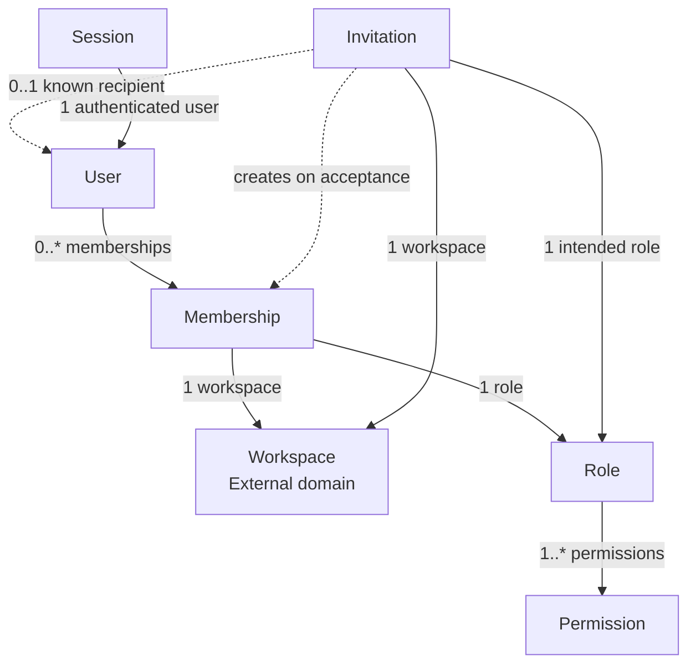

Le `Membership` constitue le point de liaison principal entre l'identité d'un `User`, son appartenance à un `Workspace` et les autorisations définies par un `Role`.

---

# Tableau des relations

| Source | Cible | Cardinalité | Nature | Description |
|--------|-------|-------------|--------|-------------|
| `User` | `Membership` | 1 → 0..* | Indirect ownership | Un `User` peut appartenir à plusieurs `Workspace`. |
| `Membership` | `User` | * → 1 | Référence obligatoire | Chaque `Membership` appartient à un unique `User`. |
| `Membership` | `Workspace` | * → 1 | Référence externe obligatoire | Chaque `Membership` représente une appartenance à un unique `Workspace`. |
| `Membership` | `Role` | * → 1 | Référence obligatoire | Chaque `Membership` reçoit un unique `Role`. |
| `Role` | `Workspace` | * → 1 | Référence externe obligatoire | Chaque `Role` est défini dans un unique `Workspace`. |
| `Role` | `Permission` | * → 1..* | Composition fonctionnelle | Un `Role` regroupe plusieurs `Permission`. |
| `Invitation` | `Workspace` | * → 1 | Référence externe obligatoire | Chaque `Invitation` concerne un unique `Workspace`. |
| `Invitation` | `Role` | * → 1 | Référence obligatoire | Chaque `Invitation` prépare l'attribution d'un `Role`. |
| `Invitation` | `User` | * → 0..1 | Référence facultative | Le destinataire peut déjà correspondre à un `User`. |
| `Invitation` | `Membership` | 1 → 0..1 | Relation de création | Une `Invitation` acceptée crée un `Membership`. |
| `Session` | `User` | * → 1 | Référence obligatoire | Chaque `Session` authentifie un unique `User`. |

---

# Relation entre User et Membership

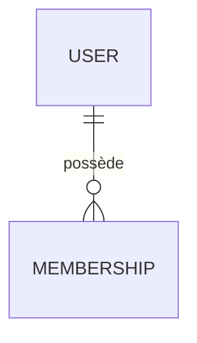

Un `User` peut posséder zéro, un ou plusieurs `Membership`.

Un `Membership` appartient toujours à un unique `User`.

Le `User` ne contient pas ses `Membership` dans sa frontière transactionnelle. Il peut connaître leurs identifiants ou les retrouver par l'intermédiaire d'un service de lecture.

La suppression ou la désactivation d'un `Membership` ne modifie pas l'identité du `User`.

## Cardinalité

```text
User 1 ───────── 0..* Membership
```

## Signification métier

Cette relation permet à une même personne :

- d'utiliser une identité unique dans Atlas ;
- d'appartenir à plusieurs `Workspace` ;
- de posséder un `Role` différent dans chaque `Workspace` ;
- de quitter un `Workspace` sans perdre son compte.

---

# Relation entre Membership et Workspace

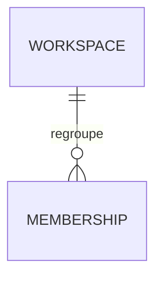

Un `Membership` représente toujours l'appartenance d'un `User` à un unique `Workspace`.

Le `Workspace` appartient à un domaine distinct. Le domaine `Identity` ne possède donc pas son état interne.

Le `Membership` conserve uniquement une référence stable vers le `Workspace`.

## Cardinalité

```text
Workspace 1 ───────── 0..* Membership
Membership * ──────── 1 Workspace
```

## Frontière de propriété

Le domaine `Identity` possède :

- le `Membership` ;
- son état ;
- le `Role` qui lui est attribué ;
- la relation entre le `User` et le `Workspace`.

Le domaine `Workspace` possède :

- l'identité du `Workspace` ;
- ses paramètres ;
- son état ;
- son cycle de vie ;
- ses données métier.

Le domaine `Identity` ne modifie jamais directement un `Workspace`.

---

# Relation entre Membership et Role

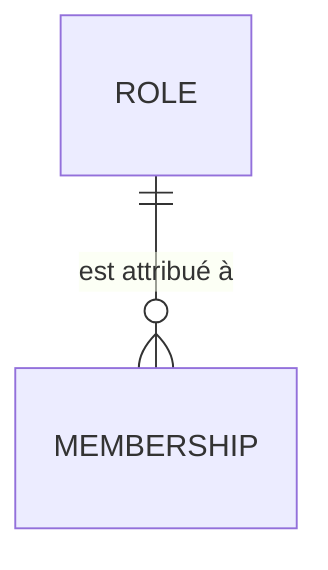

Chaque `Membership` possède exactement un `Role` actif.

Un même `Role` peut être attribué à plusieurs `Membership`.

Le `Role` et le `Membership` doivent appartenir au même `Workspace`.

## Cardinalité

```text
Role 1 ───────── 0..* Membership
Membership * ─── 1 Role
```

## Signification métier

Cette relation détermine les autorisations du `User` dans le contexte d'un `Workspace`.

Le `Role` n'est jamais attribué directement au `User`.

La formulation correcte est :

> Le `Membership` du `User` possède le `Role` `Admin` dans ce `Workspace`.

La formulation suivante est imprécise :

> Le `User` possède le `Role` `Admin`.

Un même `User` peut être administrateur dans un `Workspace` et simple membre dans un autre.

---

# Relation entre Role et Workspace

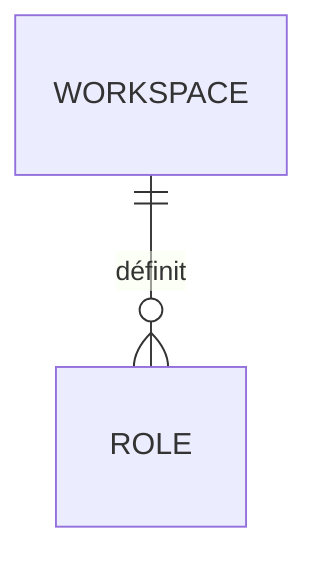

Chaque `Role` appartient à un unique `Workspace`.

Un `Workspace` possède un ou plusieurs `Role`, notamment ses rôles système initiaux.

Deux `Workspace` peuvent posséder des rôles portant le même nom sans qu'il s'agisse du même `Role`.

## Cardinalité

```text
Workspace 1 ───────── 1..* Role
Role * ────────────── 1 Workspace
```

## Conséquences

Le nom d'un `Role` n'est pas globalement unique.

Par exemple, deux `Workspace` peuvent chacun posséder un rôle nommé `Accountant`, avec :

- des identifiants différents ;
- des descriptions différentes ;
- des ensembles de `Permission` différents.

L'identité d'un `Role` est portée par son `RoleId`, jamais par son nom.

---

# Relation entre Role et Permission

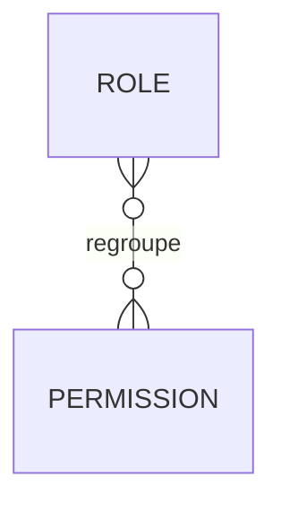

Un `Role` regroupe une ou plusieurs `Permission`.

Une `Permission` peut être utilisée par plusieurs `Role`, dans plusieurs `Workspace`.

La `Permission` est définie globalement par Atlas. Elle n'appartient pas au `Role` ni au `Workspace`.

## Cardinalité

```text
Role * ───────── 1..* Permission
Permission * ─── 0..* Role
```

## Signification métier

Le `Role` compose des autorisations à partir du catalogue global de `Permission`.

Le raisonnement d'autorisation suit cette chaîne :

```text
User
  │
  ▼
Membership
  │
  ▼
Role
  │
  ▼
Permission
```

Une `Permission` n'est jamais attribuée directement :

- à un `User` ;
- à un `Membership` ;
- à une `Session`.

---

# Relation entre Invitation et Workspace

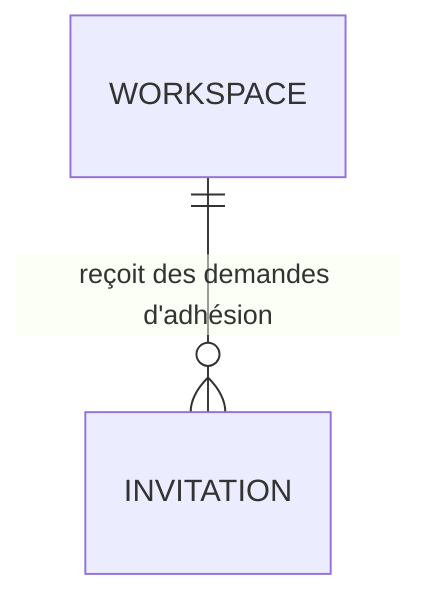

Chaque `Invitation` concerne un unique `Workspace`.

Le `Workspace` ciblé ne peut pas être modifié après la création de l'`Invitation`.

## Cardinalité

```text
Workspace 1 ───────── 0..* Invitation
Invitation * ──────── 1 Workspace
```

Une nouvelle `Invitation` doit être créée lorsque la même personne doit être invitée dans un autre `Workspace`.

---

# Relation entre Invitation et Role

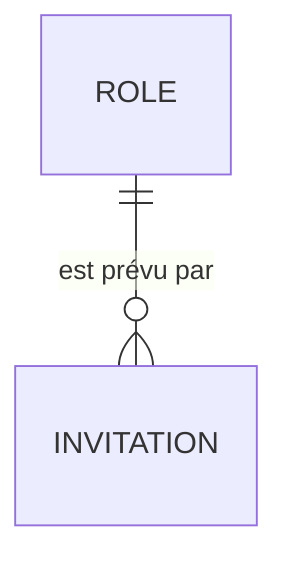

Chaque `Invitation` prépare l'attribution d'un unique `Role`.

Le `Role` doit appartenir au même `Workspace` que l'`Invitation`.

## Cardinalité

```text
Role 1 ───────── 0..* Invitation
Invitation * ─── 1 Role
```

Le `Role` prévu est appliqué au `Membership` créé lors de l'acceptation.

Si le `Role` devient indisponible avant l'acceptation, l'`Invitation` ne doit pas être acceptée sans résolution explicite.

---

# Relation entre Invitation et User

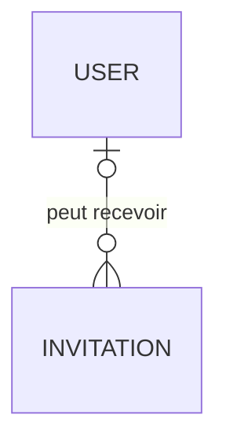

Une `Invitation` cible d'abord une adresse e-mail.

Elle peut être reliée à un `User` existant lorsque cette adresse correspond déjà à une identité Atlas.

Cette relation reste facultative tant que le destinataire ne possède pas de compte.

## Cardinalité

```text
User 1 ───────── 0..* Invitation
Invitation * ─── 0..1 User
```

L'absence de `User` associé n'empêche pas la création ou l'envoi de l'`Invitation`.

---

# Relation entre Invitation et Membership

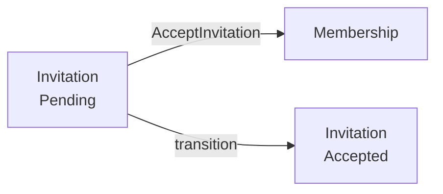

Une `Invitation` ne contient pas de `Membership`.

Lorsqu'elle est acceptée, un processus métier :

1. valide l'`Invitation` ;
2. crée un `Membership` ;
3. attribue le `Role` prévu ;
4. marque l'`Invitation` comme acceptée.

## Cardinalité

```text
Invitation 1 ───────── 0..1 Membership
Membership 1 ───────── 0..1 originating Invitation
```

Tous les `Membership` ne proviennent pas nécessairement d'une `Invitation`.

Par exemple, le premier `Membership` propriétaire peut être créé automatiquement lors de la création du `Workspace`.

---

# Relation entre Session et User

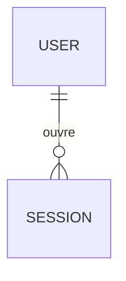

Chaque `Session` authentifie un unique `User`.

Un `User` peut posséder plusieurs `Session` actives simultanément.

## Cardinalité

```text
User 1 ───────── 0..* Session
Session * ────── 1 User
```

La `Session` ne possède aucune relation directe avec :

- un `Workspace` ;
- un `Membership` ;
- un `Role` ;
- une `Permission`.

Elle prouve uniquement l'identité du `User`.

Le contexte d'autorisation est résolu au moment où le `User` agit dans un `Workspace`.

---

# Résolution du contexte d'autorisation

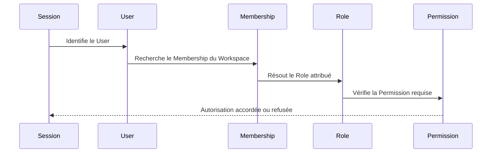

L'évaluation d'une autorisation nécessite :

1. une `Session` active ;
2. un `User` identifié ;
3. un `Membership` actif dans le `Workspace` ciblé ;
4. un `Role` valide ;
5. la `Permission` requise.

L'absence de l'un de ces éléments entraîne un refus d'accès.

---

# Matrice de propriété

| Concept | Domaine propriétaire | Référencé par `Identity` | Modifiable par `Identity` |
|---------|----------------------|--------------------------|---------------------------|
| `User` | `Identity` | Oui | Oui |
| `Membership` | `Identity` | Oui | Oui |
| `Role` | `Identity` | Oui | Oui |
| `Permission` | Plateforme Atlas | Oui | Non |
| `Invitation` | `Identity` | Oui | Oui |
| `Session` | `Identity` | Oui | Oui |
| `Workspace` | `Workspace` | Oui | Non |

Le fait qu'un concept soit référencé par le domaine ne signifie pas qu'il lui appartient.

---

# Sens des références

Les références entre agrégats suivent les règles suivantes :

- `Membership` référence `User`, `Workspace` et `Role` par leurs identifiants ;
- `Role` référence `Workspace` par son identifiant ;
- `Role` référence les `Permission` par leur `PermissionKey` ;
- `Invitation` référence `Workspace`, `Role` et éventuellement `User` par leurs identifiants ;
- `Session` référence `User` par son identifiant ;
- aucun agrégat ne contient directement un autre agrégat.

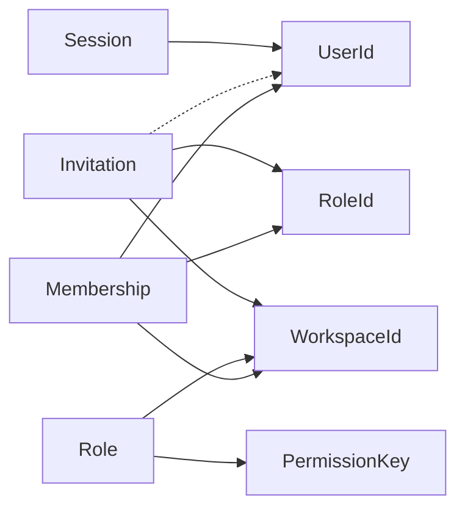

---

# Relations interdites

Les relations suivantes ne doivent jamais être introduites.

## User vers Role

Un `User` ne possède jamais directement de `Role`.

```text
User ─X─> Role
```

Le `Role` est toujours attribué à un `Membership`.

---

## User vers Permission

Un `User` ne possède jamais directement de `Permission`.

```text
User ─X─> Permission
```

Les `Permission` sont obtenues via la chaîne `Membership` → `Role`.

---

## Membership vers Permission

Un `Membership` ne reçoit jamais directement de `Permission`.

```text
Membership ─X─> Permission
```

Cette règle empêche les exceptions individuelles et garantit que toutes les autorisations sont explicables par un `Role`.

---

## Session vers Workspace

Une `Session` n'est pas liée à un unique `Workspace`.

```text
Session ─X─> Workspace
```

Un même `User` authentifié peut accéder à plusieurs `Workspace` au cours de la même `Session`.

---

## Invitation contenant un Membership

Une `Invitation` ne contient jamais un `Membership` anticipé.

```text
Invitation ─X─> Embedded Membership
```

Le `Membership` n'existe qu'après l'acceptation effective de l'`Invitation`.

---

## Role possédant Permission

Un `Role` ne possède pas le cycle de vie des `Permission`.

```text
Role ─X─> Owned Permission
```

Il référence uniquement des définitions globales gérées par Atlas.

---

# Règles de navigation

Les relations structurelles ne supposent pas une navigation bidirectionnelle dans l'implémentation.

Par exemple :

- un `Membership` doit connaître son `UserId` ;
- un `User` n'a pas besoin de charger tous ses `Membership` ;
- un `Role` ne doit pas charger tous les `Membership` qui l'utilisent ;
- une `Permission` ne doit pas connaître les `Role` qui la référencent.

Les relations inverses peuvent être exposées par des modèles de lecture sans appartenir aux agrégats.

---

# Cohérence transactionnelle

Les relations internes à un agrégat bénéficient d'une cohérence immédiate.

Les relations entre agrégats utilisent une cohérence orchestrée.

Exemples :

| Opération | Agrégats concernés | Stratégie |
|-----------|---------------------|-----------|
| Créer un `User` | `User` | Transaction unique |
| Modifier un `Role` | `Role` | Transaction unique |
| Changer le `Role` d'un membre | `Membership` | Validation externe puis transaction unique |
| Accepter une `Invitation` | `Invitation`, `Membership` | Processus métier orchestré |
| Révoquer toutes les sessions | Plusieurs `Session` | Traitement coordonné |
| Supprimer un `Role` utilisé | `Role`, plusieurs `Membership` | Réattribution préalable obligatoire |

Une transaction ne modifie pas simultanément plusieurs agrégats sans orchestration explicite.

---

# Synthèse

Le modèle relationnel du domaine `Identity` repose sur les principes suivants :

- le `User` porte l'identité ;
- le `Membership` porte l'appartenance ;
- le `Workspace` définit le contexte de collaboration ;
- le `Role` regroupe les autorisations ;
- la `Permission` représente une capacité élémentaire ;
- l'`Invitation` prépare la création d'un `Membership` ;
- la `Session` authentifie le `User`.

La chaîne fondamentale du domaine est :

```text
User
  │
  ▼
Membership
  │
  ├── Workspace
  │
  ▼
Role
  │
  ▼
Permission
```

Cette structure garantit que l'identité, l'appartenance, le contexte de travail et les autorisations restent distincts.