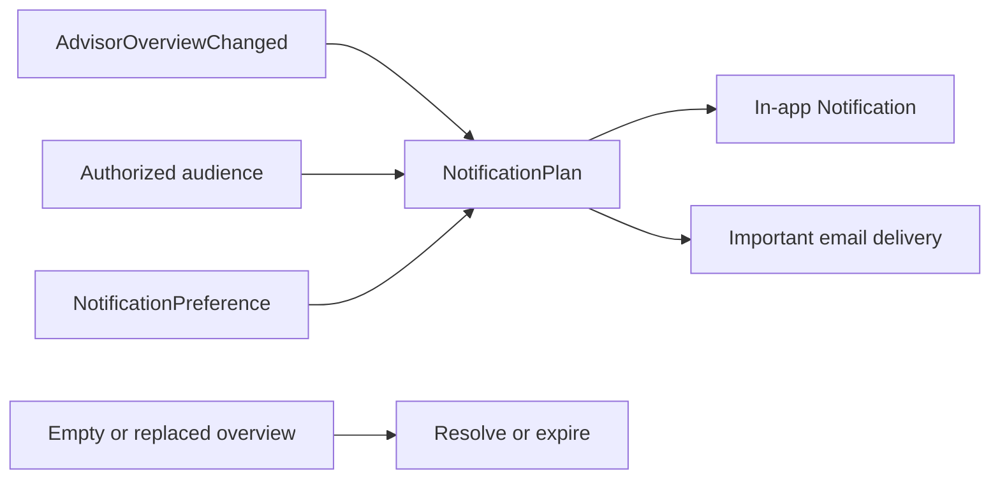

# Notifications

> Notifications remet une information déjà décidée par son domaine source au
> bon utilisateur et sur un canal autorisé, sans changer son sens ni sa priorité.

Il répond à cinq questions :

1. quel fait public justifie la notification ;
2. quels utilisateurs actifs sont autorisés à la recevoir ;
3. quels canaux ont été consentis et sont applicables ;
4. le message est-il nouveau, dupliqué, remplacé ou résolu ;
5. quel est l'état exact de sa remise et de sa lecture.

## Responsabilités

Notifications possède :

- la `NotificationPolicy` globale, immuable et versionnée ;
- les `NotificationTopicCursor`, `NotificationPlan`, `Notification` et
  `NotificationPreference` ;
- l'inbox par utilisateur et son `NotificationReadState` ;
- les choix de canaux, suppressions et limites de fréquence ;
- les `NotificationDelivery`, tentatives et résultats de fournisseur ;
- les templates et contenus minimisés versionnés.

Notifications ne possède pas :

- la Recommendation, sa priorité ou sa validité métier ;
- les audiences Identity, adresses e-mail ou permissions ;
- l'état du Workspace ;
- les devis, factures, invitations ou secrets de sécurité ;
- la décision d'envoyer une alerte marketing ou une automatisation.

## Flux 1.0

## Garanties essentielles

- aucun message Advisor avant stabilisation de l'AdvisorOverview ;
- aucun e-mail de recommandation sans opt-in explicite ;
- aucune adresse e-mail brute stockée dans Notification ;
- aucune nouvelle notification si la PrimaryRecommendation est inchangée ;
- aucune confusion entre accepted par le fournisseur et delivered ;
- aucune suppression silencieuse : chaque décision de canal est auditée ;
- aucune mutation du domaine source après un clic.

## Statut

Notifications 1.0 est `In Review`. Sa couverture complète figure dans
[`consolidation-matrix.md`](consolidation-matrix.md).
