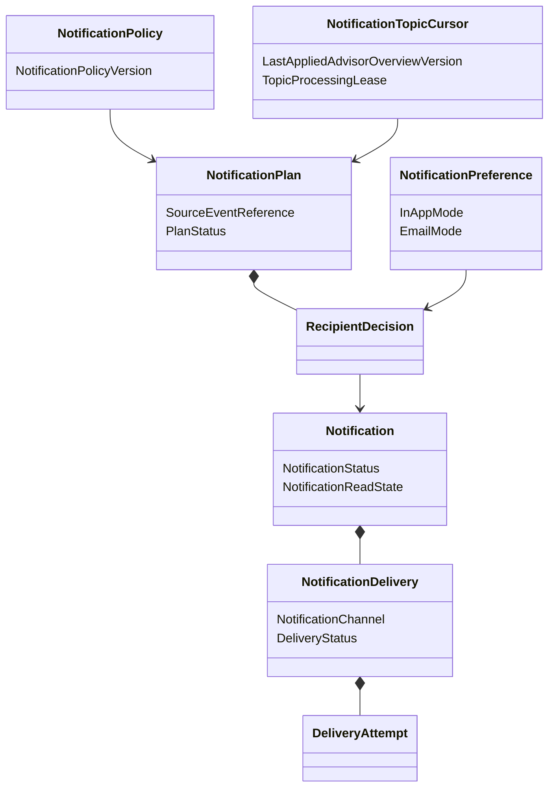

# Modèle du domaine

## Vue conceptuelle



## Chaîne de remise

```text
public Advisor event
        ↓ exact Advisor read
NotificationPlan + authorized Identity audience
        ↓ preferences and policy
0..n recipient Notification
        ├── in-app inbox
        └── email NotificationDelivery
```

## Quatre agrégats

- `NotificationPlan` garantit le traitement complet et idempotent d'un événement
  source pour toute son audience ;
- `NotificationTopicCursor` sérialise les plans d'évaluation d'un topic et
  empêche une régression d'AdvisorOverviewVersion ;
- `Notification` porte le contenu personnel, le thread, la lecture et les
  livraisons ;
- `NotificationPreference` porte le consentement de canal d'un User dans un
  Workspace.

## Vérités distinctes

```text
NotificationStatus       -> pertinence du message
NotificationReadState    -> décision de lecture de l'utilisateur
DeliveryStatus           -> résultat d'un canal externe
```

Aucune de ces dimensions n'est déduite silencieusement d'une autre.

## Frontière avec le fournisseur

Notifications confie une NotificationDelivery à un port Email. La réponse
synchrone peut prouver Accepted, jamais Delivered. Les callbacks sont
authentifiés, dédupliqués et appliqués à la ProviderMessageReference exacte.
