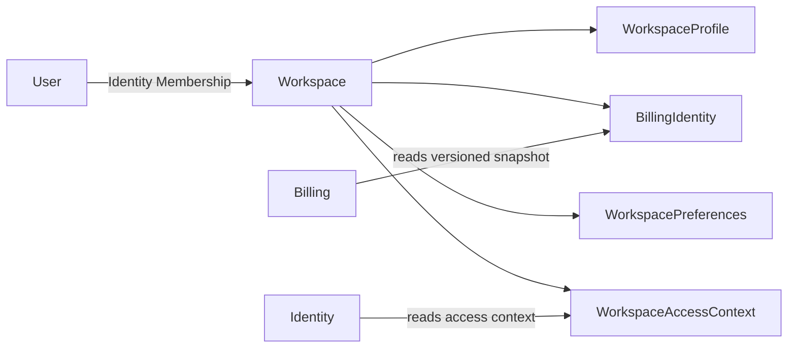

# Workspace

> Workspace porte le cadre stable d'une activité professionnelle dans Atlas.

Il répond à trois questions :

1. quelle activité utilise Atlas ;
2. sous quelle identité et avec quelles préférences elle opère ;
3. si ce contexte peut actuellement être utilisé.

---

## Responsabilités

Workspace possède :

- l'identité stable de l'activité ;
- son profil commercial ;
- son identité de facturation réutilisable ;
- ses préférences principales ;
- son cycle de vie et son état d'accès public ;
- les versions publiques permettant aux consommateurs d'invalider leurs caches.

Workspace ne possède pas :

- les utilisateurs, memberships, rôles ou permissions, qui appartiennent à
  `Identity` ;
- les clients et opportunités, qui appartiennent à `CRM` ;
- les devis, factures, paiements, règles fiscales, séquences de numérotation ou
  conditions de paiement, qui appartiennent à `Billing` ;
- les abonnements commerciaux à Atlas ;
- les recommandations et indicateurs métier.

---

## Modèle 1.0



`Workspace` est l'unique agrégat du bounded context 1.0. Les autres éléments du
diagramme sont des Value Objects ou des contrats de lecture.

---

## Cycle de vie

```text
Provisioning -> Active -> Restricted -> Active
       |           |           |
       +-----------+-----------+-> Closed
```

- `Provisioning` attend la fin du bootstrap inter-domaines ;
- `Active` autorise l'usage ordinaire ;
- `Restricted` réserve l'accès aux workflows de sécurité ou de remédiation ;
- `Closed` est terminal et conserve l'historique.

Le contrat public simplifie ce cycle en `Active`, `Restricted` et `Closed`.
`Provisioning` est exposé comme `Restricted` afin qu'aucun accès ordinaire ne
soit accordé avant la création d'un owner actif dans `Identity`.

---

## Contrats majeurs

| Consommateur | Contrat Workspace |
|---|---|
| `Identity` | `getWorkspaceAccessContext` et `WorkspaceAccessStateChanged` |
| `Billing` | snapshots versionnés de `BillingIdentity` et des préférences utiles |
| autres domaines | identité, libellé et état strictement nécessaires à leur usage |

Tous les consommateurs passent par [`api.md`](api.md) ou par les événements de
[`events.md`](events.md). Aucun domaine ne lit le stockage interne de Workspace.

---

## Statut de consolidation

Workspace 1.0 est `In Review`. Les décisions normatives sont fermées pour le
périmètre 1.0 ; [`future.md`](future.md) contient les extensions non retenues.

La traçabilité complète figure dans
[`consolidation-matrix.md`](consolidation-matrix.md).
