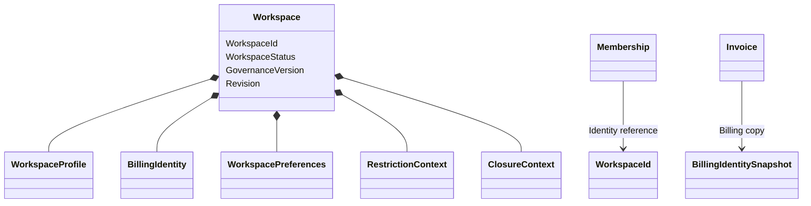

# Modèle du domaine

## Vue conceptuelle



`Workspace` est l'unique entité et racine d'agrégat. Les données qui le
composent sont remplacées comme des valeurs immuables.

---

## État du Workspace

| Statut interne | Sens | État d'accès public |
|---|---|---|
| `Provisioning` | bootstrap incomplet, usage ordinaire interdit | `Restricted` |
| `Active` | usage ordinaire autorisé | `Active` |
| `Restricted` | usage ordinaire suspendu | `Restricted` |
| `Closed` | fermeture logique terminale | `Closed` |

`AccessState` est une projection contractuelle, pas un second cycle de vie
modifiable indépendamment.

---

## Versions

Le modèle distingue :

- `Revision`, pour la concurrence optimiste de l'agrégat ;
- `GovernanceVersion`, modifiée lorsque la décision d'accès peut changer ;
- `ProfileVersion`, modifiée avec `WorkspaceProfile` ;
- `BillingIdentityVersion`, modifiée avec `BillingIdentity` ;
- `PreferencesVersion`, modifiée avec `WorkspacePreferences`.

Une version spécialisée permet à un consommateur d'invalider uniquement le
cache ou snapshot concerné.

---

## Identité et snapshots

Le profil courant n'est pas l'historique d'un document externe.

```text
Billing requests current BillingIdentity v4
                     |
                     v
Invoice stores BillingIdentitySnapshot v4
                     |
Workspace later becomes BillingIdentity v5
                     |
Existing Invoice still contains snapshot v4
```

Les événements permettent de retracer le changement, mais ils ne donnent pas à
Workspace la propriété du document consommateur.

---

## Isolement

Chaque ressource métier externe porte son propre `WorkspaceId`. Un identifiant
provenant d'un Workspace ne peut pas être résolu implicitement dans un autre.

Workspace ne contient aucune collection de clients, factures, memberships ou
recommandations. Ces domaines conservent leurs propres agrégats et références.
