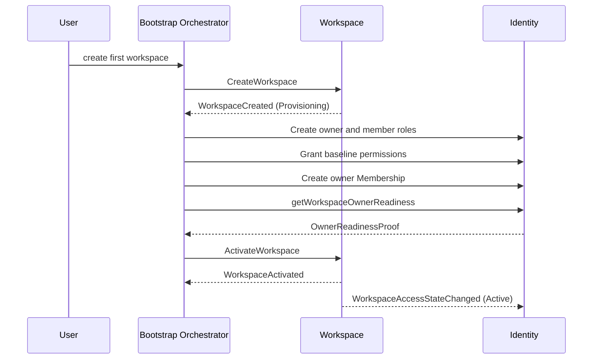

# Workflows

## Bootstrap d'un Workspace

Le bootstrap est une saga, pas une commande distribuée.



### Reprise

- chaque étape possède une clé dérivée du `WorkspaceId` et du workflow ;
- un retry relit l'état avant de répéter l'intention ;
- les conflits sont résolus par la version attendue ;
- un provisioning ancien est observable et repris ou fermé par un workflow
  explicite ;
- aucune suppression physique ne masque un échec.

### Visibilité

Le Workspace n'apparaît comme utilisable qu'après `WorkspaceActivated`. Les
interfaces peuvent afficher une progression de provisioning sans permettre les
commandes ordinaires.

---

## Mise à jour du profil

```text
Authorize exact permission in Identity
  -> load Workspace and expected revision
  -> normalize and validate new Value Object
  -> replace current value and increment its version
  -> publish the corresponding event
```

Les consommateurs intéressés relisent la nouvelle version. Les snapshots
historiques restent inchangés.

---

## Restriction

Une autorité de sécurité ou conformité :

1. qualifie une raison structurée ;
2. exécute `RestrictWorkspace` avec une capacité système bornée ;
3. publie `WorkspaceRestricted` et `WorkspaceAccessStateChanged` ;
4. laisse Identity invalider les autorisations ordinaires ;
5. lance les remédiations nécessaires dans chaque domaine propriétaire.

La restriction ne supprime ni memberships, ni clients, ni documents.

---

## Restauration de l'accès

Le workflow :

1. confirme la résolution de la cause de restriction ;
2. demande une preuve récente d'owner actif à Identity ;
3. exécute `RestoreWorkspaceAccess` ;
4. publie la nouvelle version de gouvernance ;
5. laisse les consommateurs reconstruire leurs décisions.

Un owner absent bloque la restauration sans modifier le Workspace.

---

## Fermeture

La fermeture coordonne sans prendre possession des données externes :

```text
Closure request with step-up
  -> authorization and explicit confirmation
  -> readiness checks from required domains
  -> CloseWorkspace
  -> WorkspaceClosed + WorkspaceAccessStateChanged
  -> retention/export/anonymization workflows by owning domains
```

La readiness identifie les opérations qui nécessitent une décision préalable ;
elle ne transfère pas à Workspace la propriété des factures ou memberships.

Une fermeture imposée par conformité utilise une capacité système distincte de
la permission owner. Depuis `Restricted` ou `Provisioning`, seule cette voie
système peut commettre la fermeture ; une permission de rôle n'est pas rendue
effective dans un Workspace non actif.

---

## Changement d'owner

Le transfert d'owner reste un workflow Identity. Workspace ne reçoit aucun
changement de profil et conserve le même `WorkspaceId`.

Si Identity signale temporairement l'absence d'owner, ses propres invariants
doivent empêcher le commit. Workspace ne tente pas de réparer le rôle.
